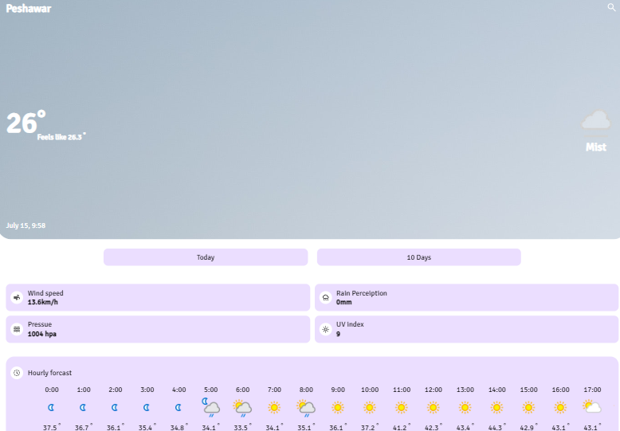

# Weather Application in React


## About the Project

+ Use data from external API's
+ Show current Weather and 5 days forecast
+ Search any city around the world

## API Used

+ Two Api are used one for current weather one for forecast
+ **[Weather Api](https://www.weatherapi.com/)** for current weather and **[Open Weather](https://openweathermap.org/api)** for forecast

*note that both api require key to server request if the key is not working you have to generate your own form the links*

## Installation

+ ```npm install```
+ ```npm run dev``` or ```yarn run dev```
+ ```npm run dev -- --host``` to host on local network

## Future Question

Contact me **talhasifat23@gmail.com**



